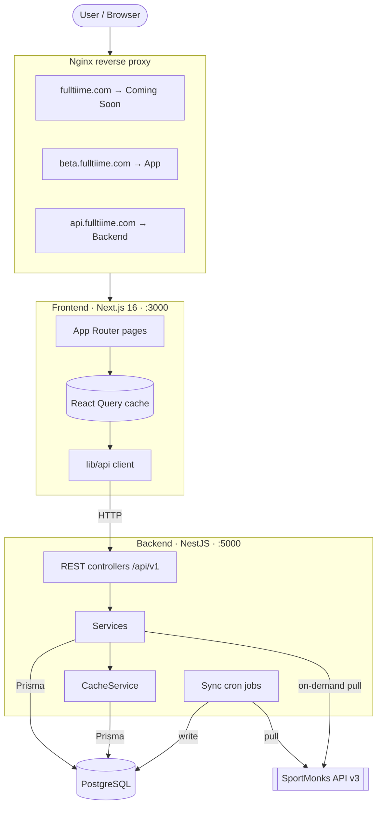
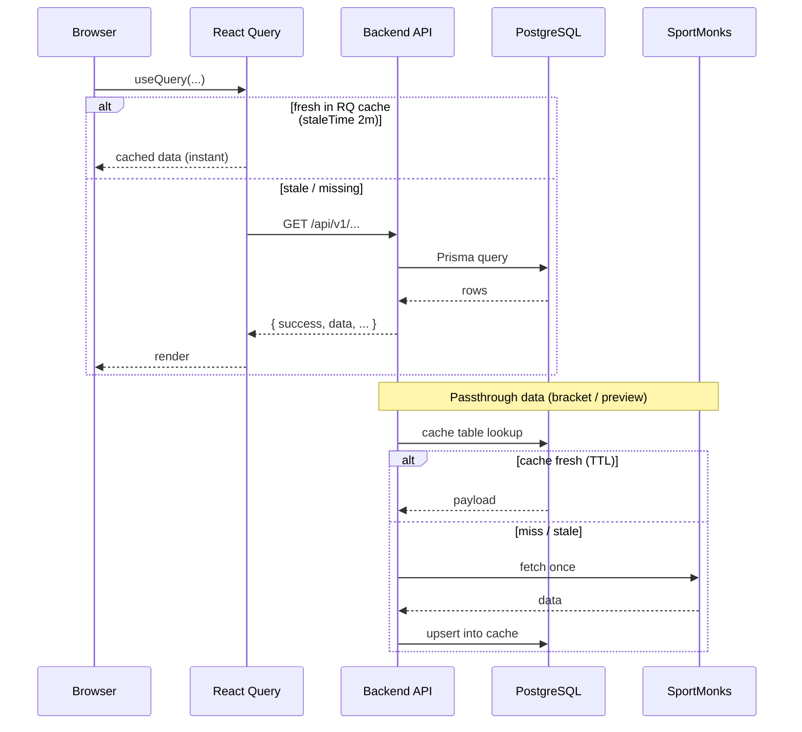
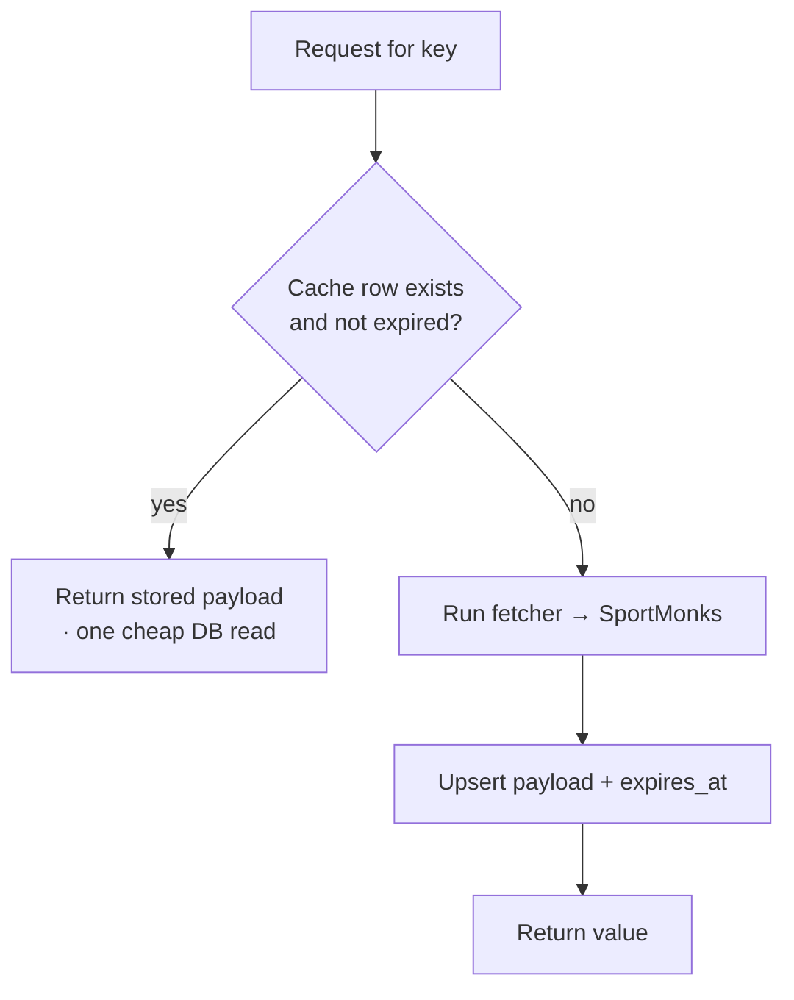
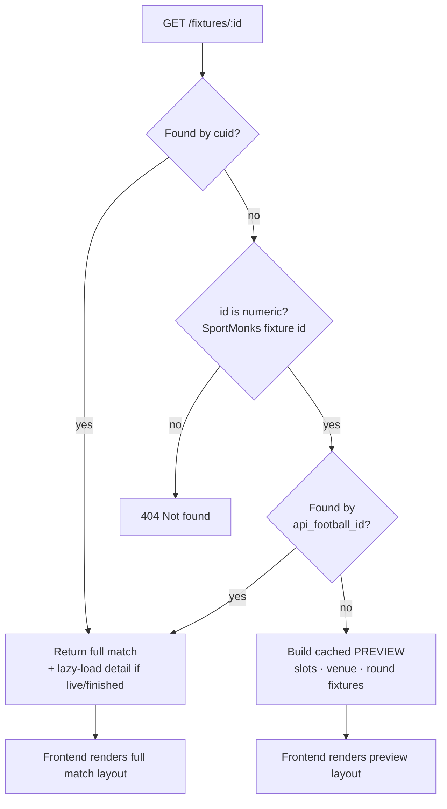
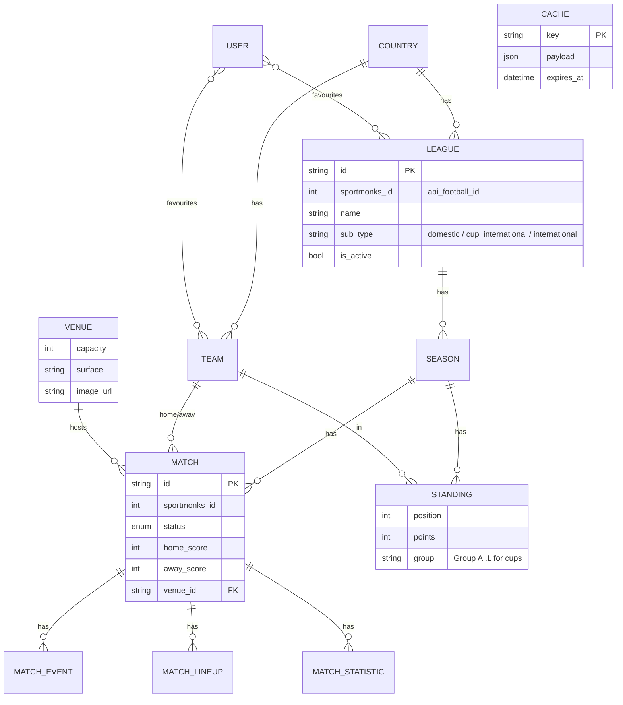
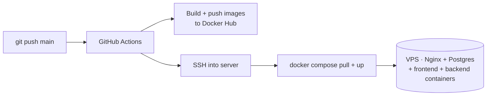

# Fulltiime — Architecture & Flow

---

## 1. System overview



**Key idea:** the frontend never talks to SportMonks directly. The backend syncs
SportMonks into Postgres on a schedule; pages read from our DB through the API.
A few slow-changing things (brackets, match previews) are fetched on demand and
cached in a DB table.

---

## 2. Data sync pipeline

SportMonks data is pulled by scheduled cron jobs and stored in our DB. Pages then
read from the DB, so reads are fast and don't depend on SportMonks being up.

```mermaid
flowchart LR
    subgraph cron[Sync cron jobs]
        L[syncLeagues · daily 2am]
        T[syncTeams · Mon 3am]
        V[syncVenues · Mon 4am]
        F[syncFixtures · every 6h]
        S[syncStandings · daily 2am]
        Live[syncLiveScores · every 5m]
    end

    sm[[SportMonks]]

    subgraph pg[(PostgreSQL)]
        leagues[(leagues + seasons)]
        teams[(teams)]
        venues[(venues)]
        matches[(matches)]
        standings[(standings)]
    end

    L --> sm --> leagues
    T --> sm --> teams
    V --> sm --> venues
    F --> sm --> matches
    S --> sm --> standings
    Live --> sm --> matches

    leagues -. order matters .-> teams -.-> venues -.-> matches -.-> standings
```

- **Dynamic leagues:** `syncLeagues` pulls whatever's in the SportMonks
  subscription — no hardcoded IDs. Leagues dropped from the plan are marked
  `is_active=false`.
- **Live scores** (every 5 min) carry events, lineups and stats via includes, so
  one call refreshes everything for in-play matches.
- **Venues** only sync for `domestic` + `cup_international` competitions (the
  global qualifiers reference hundreds of venues and aren't surfaced).

---

## 3. A read request (with the two cache layers)



- **Frontend (React Query):** `staleTime 2m`, `gcTime 30m`, `keepPreviousData`,
  `refetchOnWindowFocus:false` → instant revisits, no skeleton flash, live data
  still polls via `refetchInterval`.
- **Backend (DB cache):** see §4.

---

## 4. DB-backed cache (`CacheService.getOrSet`)

Used for slow-changing passthrough data (knockout **brackets**, placeholder
**match previews**) so SportMonks is hit at most once per key per TTL — shared
across users and server instances, and surviving restarts.



| Data | Key | TTL |
|---|---|---|
| Knockout bracket | `bracket:<leagueId>` | 12h |
| Match preview | `preview:<fixtureId>` | 6h |

---

## 5. Match detail resolution

A match link can carry **our cuid** (real synced match) or a **SportMonks fixture
id** (a bracket tie). Placeholder knockout ties aren't in our DB, so they resolve
to a cached preview.



Both render in the **same two-column shell** (header + tabs on the left, venue +
round/competition fixtures on the right) — only the content differs.

---

## 6. Domain model (core entities)



> Brackets are **not** stored relationally — they're a passthrough fetched from
> SportMonks (stages + edges DAG) and cached in the `CACHE` table.

---

## 7. Deployment



- `NEXT_PUBLIC_*` vars are **baked at build time** (build args); backend secrets
  are injected at **runtime** via docker-compose `environment`.
- Secrets come from **GitHub Actions secrets**, exported on the server during deploy.
```
